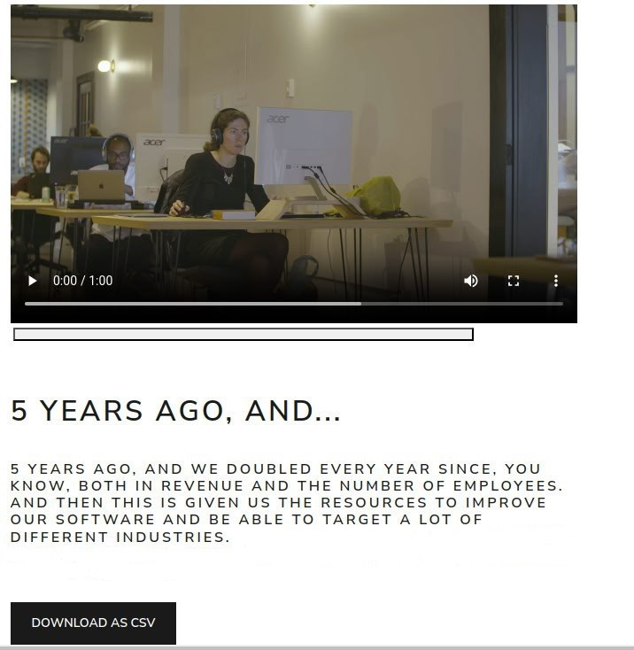

# AI EdCoach Project 

## Запуск на локальном ПК

```
git clone -b dev_service ai_ed_coach
cd ai_ed_coach
docker compose up -d --build

open localhost:10000
```


## Пример использования 

### 1. Регистриция 


### 2. Логин 


### 3. Анализ таймкодов  

#### Переход на страницу с аналитикой 


#### Загрузка видео 


#### Просмотр результатов 

